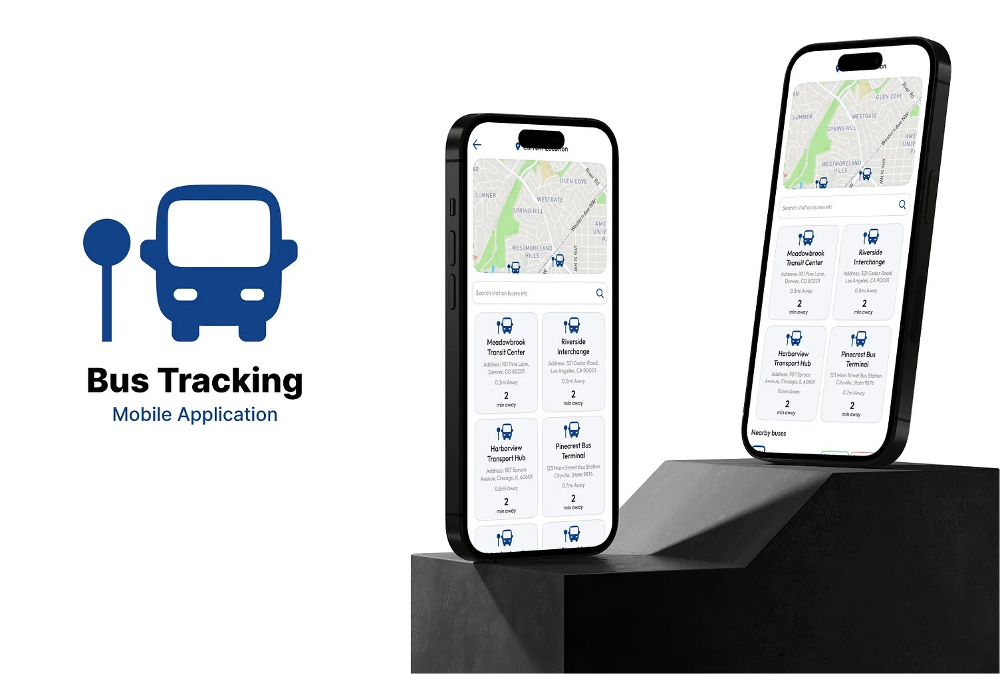

# 🚌 Bus Kahan Hai? – AI-Powered Real-Time Public Transit Assistant for Karachi  

  

**Bus Kahan Hai?** is a smart, AI-powered transit app designed to make Karachi’s local public transport **smarter, efficient, and reliable**.  
It enables commuters to **track buses in real-time, plan routes, estimate fares, and get arrival alerts** — all from their smartphones.  

---

## 📱 Application Features  

- 🚍 **Live Bus Tracking** (real-time GPS from drivers)  
- 🧠 **AI-Powered Route Planning** for faster, smarter journeys  
- 💸 **Fare Estimation** based on distance (PKR 80 ≤15km, PKR 120 >15km)  
- 📍 **Nearby Bus Stop Detection** using location services  
- 🔁 **Smart Transfer Guidance** (when to switch routes)  
- 🔔 **Arrival & Stop Alerts** (never miss your bus or destination)  
- 👥 **Role-Based Access** (Passenger vs Driver/Admin)  
- 🕒 **ETA & Frequency Updates** (peak/off-peak timings)  

---

## 🔍 Project Description  

Karachi’s bus system lacks a centralized platform for commuters. This app solves:  

- ❓ Confusion about bus routes  
- 🕒 Lack of real-time updates  
- 📍 Difficulty finding stops  
- 💸 Unclear fare structures  
- 🔁 Complicated route switching  

**Bus Kahan Hai?** bridges the communication gap between **drivers, passengers, and authorities**, making travel smooth and stress-free.  

---

## ✅ Functional Requirements  

### 👤 Passengers  
- View nearby buses and stops  
- Get AI-based best route suggestions  
- Estimate fares instantly  
- Receive alerts before stop/destination  

### 👨‍✈️ Drivers/Admin  
- Register bus and routes  
- Share real-time GPS location  
- Ensure route timing accuracy  

---

## 🗂️ Key Features Breakdown  

| Feature | Description |  
| --- | --- |  
| 🚍 **Live Bus Tracking** | Track buses via driver GPS updates |  
| 📍 **Nearby Stops** | Auto-detect closest bus stops |  
| 🧠 **AI Route Planning** | Suggest fastest & cheapest route |  
| 💸 **Fare Estimation** | PKR 80 ≤15km, PKR 120 >15km |  
| 🔁 **Transfers** | Route-switch guidance |  
| 🔔 **Alerts** | Notify before bus arrival/destination |  
| 👥 **Role-Based Login** | Passenger & Driver separate dashboards |  

---

## 🧰 Tech Stack  

- **Frontend:** Flutter (Android, iOS, Web)  
- **Backend:** Firebase (Firestore + Realtime DB)  
- **Authentication:** Firebase Auth  
- **Maps & GPS:** Google Maps API (`google_maps_flutter`)  
- **Notifications:** Firebase Cloud Messaging  
- **State Management:** Provider / Riverpod  

---

## 🗄️ Database Design  

- **Firestore:** Bus routes, stops, fares, metadata  
- **Realtime DB:** Live bus locations  
- **Auth:** Role-based access control  
- **Cloud Functions:** Notifications & custom logic  

---

## 📊 Operational Details  

- 🚍 **Bus Types:** Red (General), White (EV), Pink (Ladies)  
- ⏰ **Service Hours:** 7 AM – 10 PM  
- 🕒 **Frequency:** 15 min (peak), 30 min (off-peak)  
- 💸 **Fares:** PKR 80 ≤15km | PKR 120 >15km  
- 🛣️ **Routes:** 13+ active (R1–R13, EV1–EV5)  

---

## 🎯 Expected Outcomes  

| Impact | Benefit |  
| --- | --- |  
| 🚶‍♂️ Commuters | Easier, faster, less stressful travel |  
| 🏙️ Government | Data-driven visibility & management |  
| 📈 Urban Planning | Optimize schedules with usage data |  
| 🌱 Environment | Reduced private vehicle dependency |  
| 💼 Tourism | Visitors can navigate Karachi confidently |  

---

## 🔮 Future Enhancements  

- 🎤 Voice route guidance  
- 🔄 Offline schedules  
- 📊 Admin analytics dashboard  
- 🌐 Web-based real-time monitoring  
- ⭐ Rider ratings & feedback  

---

## 👨‍💻 Author  

**Muhammad Hassan**  
[LinkedIn](https://www.linkedin.com/in/mh-muhammadhassan/)  

---

## 🤝 Contributions  

Contributions, issues, and feature requests are welcome!  
Open a pull request to help improve **Bus Kahan Hai?** 🚀  
